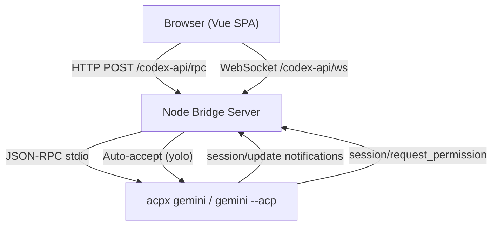

# Implement ACP Bridge for Gemini CLI

## Architecture Change

Currently, the app spawns `codex app-server` as a child process and speaks a Codex-specific JSON-RPC protocol over stdio. We need to add an **alternative ACP bridge** that spawns `acpx` (or a direct ACP agent like `gemini --acp`) and speaks the standard [ACP protocol](https://agentclientprotocol.com) instead.

The key difference: ACP uses standard JSON-RPC 2.0 with methods like `initialize`, `session/new`, `session/prompt`, `session/update` notifications, and `session/request_permission` for approvals -- vs the Codex-specific `thread/`*, `turn/`* methods the current bridge uses.




## Key Design Decisions

### 1. ACP Process Bridge (`AcpServerProcess`)

Create a new class `AcpServerProcess` in [src/server/acpBridge.ts](src/server/acpBridge.ts) that:

- Spawns `acpx gemini` (or configurable agent) with `--approve-all --format json` flags
- OR spawns `gemini --acp` directly and speaks raw ACP JSON-RPC
- Handles ACP lifecycle: `initialize` -> `session/new` -> `session/prompt` cycle
- Maps ACP `session/update` notifications to the existing UI notification format
- **Auto-accepts all `session/request_permission` requests** immediately (yolo mode)

The existing `AppServerProcess` class in [src/server/codexAppServerBridge.ts](src/server/codexAppServerBridge.ts) is the template. The new class will mirror its structure but speak ACP instead of Codex app-server protocol.

### 2. Two Approaches -- Recommend Direct ACP

**Option A: Spawn `acpx gemini` with `--format json`**

- Pros: acpx handles session management, reconnect, queue
- Cons: Extra layer; acpx emits NDJSON events, not raw JSON-RPC; need to parse acpx envelope format; heavier dependency

**Option B: Spawn `gemini --acp` directly and speak ACP JSON-RPC** (recommended)

- Pros: Direct ACP protocol, same pattern as existing `AppServerProcess`, lighter
- Cons: No session persistence across process restarts (acceptable for web UI)

**Recommendation: Option B** -- spawn the ACP agent directly (e.g. `gemini --acp`) and implement the ACP client in our bridge, similar to how `AppServerProcess` already works with Codex. This gives us full control and the cleanest integration.

### 3. ACP-to-UI Mapping

The current UI expects `UiMessage` objects with roles, text, commands, etc. The ACP bridge needs to translate:


| ACP Event                                     | UI Mapping                              |
| --------------------------------------------- | --------------------------------------- |
| `session/update` with `agent_message_chunk`   | Append to live agent message text       |
| `session/update` with `tool_call`             | Show as command execution item          |
| `session/update` with `tool_call_update`      | Update command status/output            |
| `session/update` with `plan`                  | Show as plan entries                    |
| `session/update` with `thought_message_chunk` | Show as reasoning/thinking text         |
| `session/request_permission`                  | **Auto-accept immediately** (yolo mode) |
| `session/prompt` response with `stopReason`   | Mark turn complete                      |


### 4. Auto-Accept / Yolo Mode

For `session/request_permission` requests from the agent:

- The bridge immediately responds with `{ outcome: { outcome: "selected", optionId: "<first allow option>" } }`
- No UI prompt is shown
- This maps to acpx's `--approve-all` behavior
- The bridge will look for an option with `kind: "allow_always"` first, then `kind: "allow_once"`, then just pick the first option

### 5. Agent Selection

Add a configurable agent selector so the user can pick which ACP agent to use. Store in the existing global state. Default to `gemini`. The bridge resolves the command:


| Agent    | Command                                   |
| -------- | ----------------------------------------- |
| `gemini` | `gemini --acp`                            |
| `codex`  | Existing `AppServerProcess` (no change)   |
| `claude` | `npx -y @zed-industries/claude-agent-acp` |
| Custom   | User-provided command string              |


### 6. Responsive UI Adjustments

The existing responsive design (768px breakpoint, mobile drawer sidebar) is already solid. Key adjustments:

- Ensure the ACP tool call cards (which may have different structure than Codex command executions) render correctly on mobile
- The permission auto-accept means no approval cards clutter the mobile view
- Thread title generation needs to work with ACP sessions (use first prompt text as title)

## File Changes

### New Files

- **[src/server/acpBridge.ts](src/server/acpBridge.ts)** -- `AcpServerProcess` class + `createAcpBridgeMiddleware()` function. Mirror of `codexAppServerBridge.ts` but speaking ACP protocol with auto-accept logic.

### Modified Files

- **[src/server/codexAppServerBridge.ts](src/server/codexAppServerBridge.ts)** -- Extract shared types/helpers. Add bridge selection logic (ACP vs Codex) based on config.
- **[src/server/httpServer.ts](src/server/httpServer.ts)** -- Wire ACP bridge middleware alongside or instead of Codex bridge based on config.
- **[src/composables/useDesktopState.ts](src/composables/useDesktopState.ts)** -- Handle ACP-style notifications in `applyRealtimeUpdates`. The bridge will normalize ACP events to match existing notification shapes where possible, but some new event types may need handling.
- **[src/types/codex.ts](src/types/codex.ts)** -- Add ACP-specific types if needed (tool call kinds, plan entries, etc.)
- **[src/cli/index.ts](src/cli/index.ts)** -- Add `--agent` flag to select ACP agent (default: `gemini`). Skip Codex-specific login when using ACP agent.
- **[vite.config.ts](vite.config.ts)** -- Wire ACP bridge in dev mode based on env var.
- **[src/commandResolution.ts](src/commandResolution.ts)** -- Add `resolveGeminiCommand()` and generic ACP agent resolution.
- **[tests.md](tests.md)** -- Add manual test cases for ACP/Gemini flow.

## Implementation Strategy

The cleanest approach is to make the bridge layer **pluggable**: both `AppServerProcess` (Codex) and `AcpServerProcess` (ACP/Gemini) implement the same interface, and the middleware selects which to use based on configuration. This avoids duplicating all the HTTP routing in `codexAppServerBridge.ts`.

The interface both must satisfy:

```typescript
interface AgentProcess {
  rpc(method: string, params: unknown): Promise<unknown>
  onNotification(listener: (value: { method: string; params: unknown }) => void): () => void
  respondToServerRequest(payload: unknown): Promise<void>
  listPendingServerRequests(): PendingServerRequest[]
  dispose(): void
}
```

The ACP bridge translates between the app's existing RPC surface (`thread/list`, `thread/create`, `thread/read`, etc.) and ACP methods (`session/new`, `session/prompt`, etc.), maintaining an in-memory session/thread mapping.