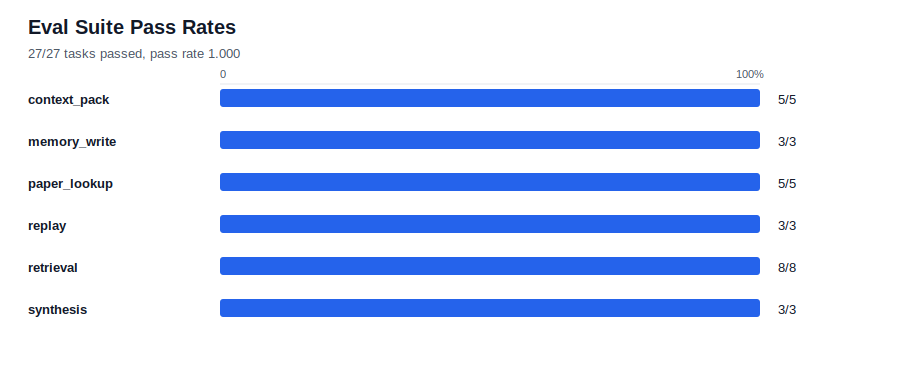
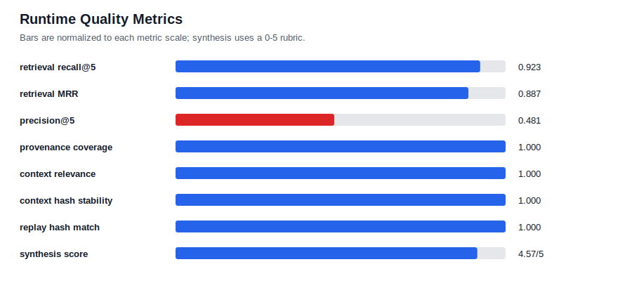
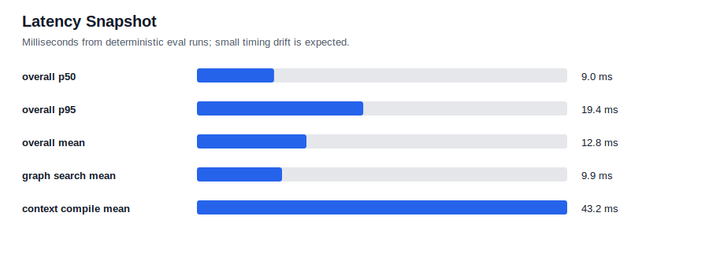

# Scientific-Agent Runtime Summary

This pass turns `lab_assistant` from static context plus graph search into a measured closed-loop runtime: trajectory records, task-routed context packs, candidate-gated memory changes, replay checks, quantitative evals, and structured hypothesis scaffolds.

## What Is Implemented

| Loop | Implemented behavior | Main artifact |
|---|---|---|
| Trajectories | Records task, memory snapshot hashes, context pack, steps, outputs, mutations, scores | `runtime/trajectory.py`, `runs/` |
| Context compiler | Builds deterministic task-routed context packs with inclusion reasons, exclusions, budgets, and stable IDs | `runtime/context_pack.py`, `context_policy/` |
| Belief graph extensions | Adds optional hypothesis/status fields and task-aware graph routes while keeping JSONL source of truth | `graph/schema.json`, `scripts/fact_graph.py` |
| Eval harness | Runs structured fixtures for retrieval, paper lookup, context packs, replay, memory writes, and synthesis | `evals/run_evals.py`, `evals/fixtures/` |
| Candidate archive | Proposes, validates, attaches evals, promotes, or rejects changes without direct durable self-editing | `runtime/mutation.py`, `improvements/` |
| Synthesis scaffold | Produces structured hypothesis objects and scores them with a deterministic rubric | `science/hypothesis.py`, `science/rubrics.py` |
| Skill metadata | Adds machine-readable skill metadata so skills can be routed and evaluated | `skills/*.yaml` |

## Current Metrics

Generated from `evals/results/latest.jsonl` with 27 deterministic fixtures.

| Metric | Value |
|---|---:|
| Eval pass rate | 1.000 |
| Tasks passed | 27/27 |
| Retrieval recall@5 mean | 0.9231 |
| Retrieval MRR mean | 0.8872 |
| Precision@5 mean | 0.4808 |
| Provenance coverage mean | 1.0000 |
| Low-confidence unsupported use | 0.0000 |
| Context relevance mean | 1.0000 |
| Context hash stability | 1.0000 |
| Replay context hash match | 1.0000 |
| Retrieved-item Jaccard | 1.0000 |
| Synthesis mean score | 4.5714 / 5 |
| Context chars mean | 12603.4 |
| Context compile latency mean | 43.2 ms |
| Overall latency p50 / p95 | 9.0 ms / 19.4 ms |
| Protected regressions vs baseline | none |

## Visuals







## What The Metrics Mean

The strongest result is repeatability: identical context-pack hashes and replay item sets under the same snapshot. Retrieval is usable for the current fixtures, with high recall and MRR, but precision@5 is lower because lexical graph search intentionally returns broad related context. Provenance gating is working in the fixture set: low-confidence unsupported use is zero and all retrieved eval hits have provenance.

## Current Limitations

- The eval suite is a smoke test, not yet a hard scientific benchmark. It has 27 fixtures and can be overfit by route or fixture-specific behavior.
- Retrieval is lexical plus task-aware filtering. There is no SQLite FTS/BM25 index yet, no vector baseline, and no large-scale latency benchmark.
- Context relevance is fixture-labeled and coarse. It checks required paths/kinds/IDs, not whether every included token was scientifically useful.
- The synthesis loop is a deterministic scaffold. It validates structure and provenance behavior, but it is not yet a full generate -> critique -> evolve workflow.
- Candidate promotion is recorded, but candidates are not automatically applied in isolated worktrees before eval comparison.
- Trajectories are usable by evals and CLIs, but production assistant calls are not yet fully instrumented end to end.
- The current latency numbers are small-local-graph timings. They should not be extrapolated to NAS-backed scans, much larger graphs, or LLM-judged synthesis.
- The baseline is the first measured runtime baseline, not a historical pre-runtime baseline.

## Stress Tests To Add

| Stress test | Why it matters | Expected pass condition |
|---|---|---|
| Graph scale-up | Current graph latency may hide O(n) behavior | 10x synthetic nodes/edges keeps paper and claim lookup under a defined p95 latency |
| Ambiguous query set | Lab shorthand like `D`, `PL`, `A5`, `C7`, and `hysteresis` can route incorrectly | Correct task-aware route and provenance-backed top hits despite ambiguous terms |
| Contradiction and stale-fact set | Scientific memory must not treat deprecated or contested claims as settled | Deprecated/contested facts are surfaced with status and not used as unsupported conclusions |
| Context budget squeeze | Small Slack/direct contexts can exclude critical evidence | Required evidence coverage remains above threshold at 3k, 6k, and 12k char budgets |
| Low-evidence synthesis | Hypothesis generation should fail gracefully when evidence is weak | Groundedness/provenance scores drop and no graph insertion is allowed |
| Candidate regression gate | Self-improvement must preserve protected tasks | A deliberately bad policy patch is rejected because replay, precision, or pass rate regresses |
| Snapshot repeatability | Same task should be replayable on the same memory snapshot | Same context pack ID and high retrieved-set Jaccard across repeated runs |
| Snapshot sensitivity | Real memory changes should be visible in hashes | Context or graph source edits change snapshot hash and are recorded in the trajectory |
| Paper-first failure mode | Paper lookup should not collapse into generic all-node search | Paper nodes are tried first; linked claims are backfill with explicit route metadata |
| Noisy provenance | Low-confidence generated deck claims can pollute retrieval | Unsupported low-confidence-use rate stays near zero on adversarial fixtures |

## Commands

```bash
python3 lab_assistant/evals/run_evals.py --suite all --output lab_assistant/evals/results/latest.jsonl
python3 lab_assistant/evals/render_summary_assets.py --summary lab_assistant/evals/results/summary.json --output-dir lab_assistant/evals/views
python3 lab_assistant/evals/compare_results.py --baseline lab_assistant/evals/results/baseline.jsonl --candidate lab_assistant/evals/results/latest.jsonl
python3 -m lab_assistant.runtime.context_pack --task-type paper_lookup --query "moire exciton optical signatures"
python3 -m lab_assistant.runtime.trajectory new --task-type claim_lookup --input "RMCD hysteresis" --dry-run
```
